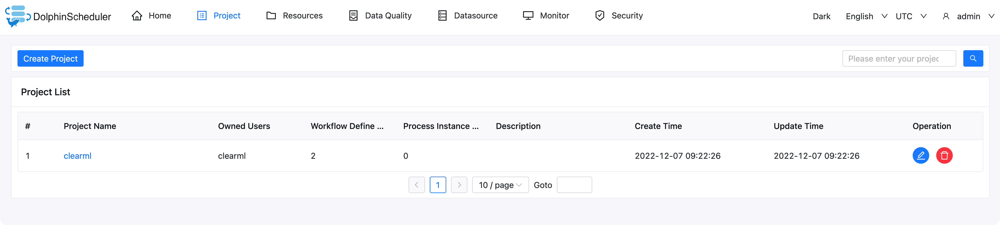
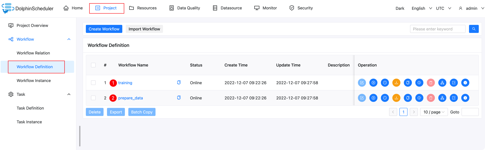
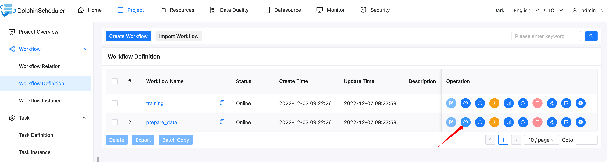
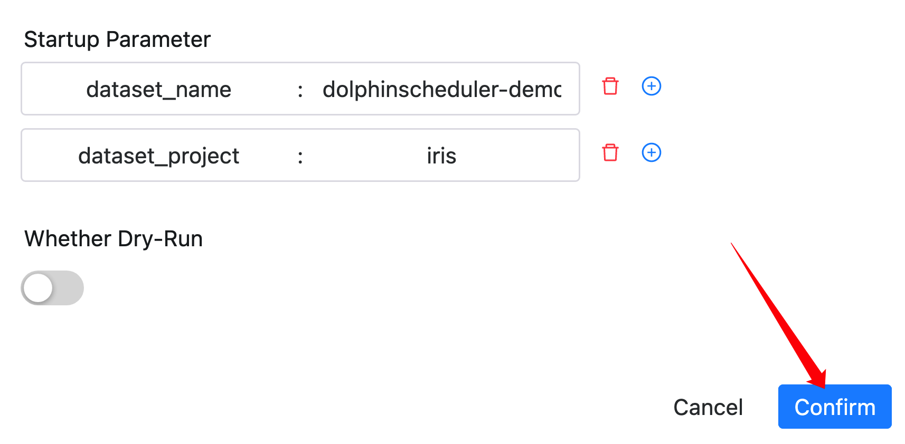
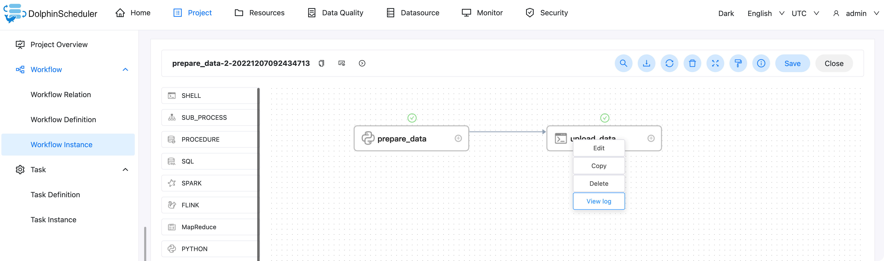
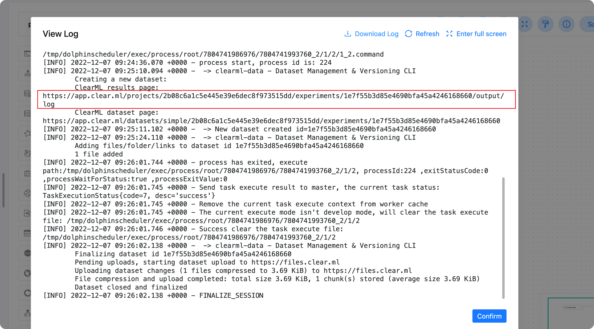
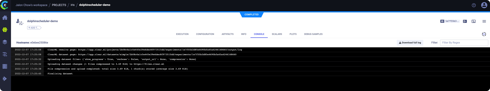
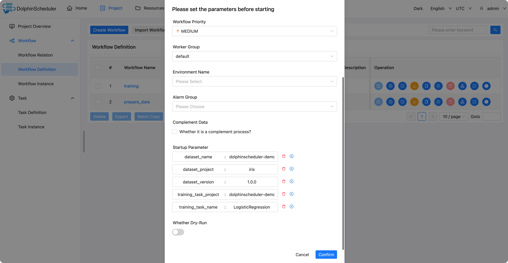
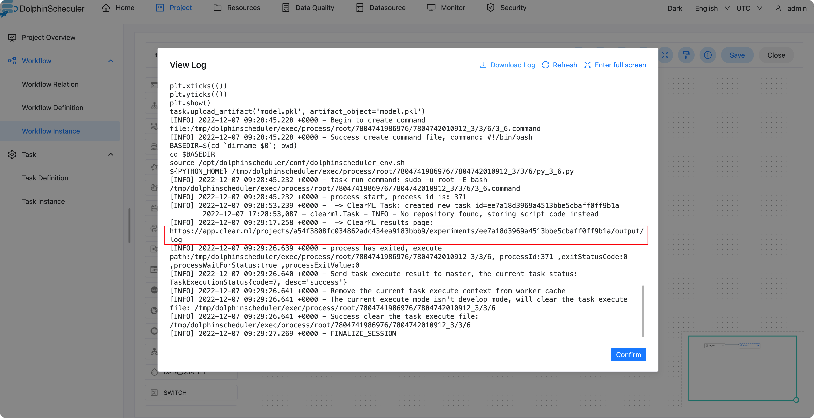
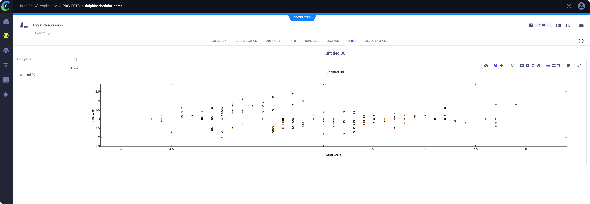

# dolphinscheduler-clearml-example


## Create ClearML CREDENTIALS

[Connect ClearML SDK to the Server](https://clear.ml/docs/latest/docs/getting_started/ds/ds_first_steps#connect-clearml-sdk-to-the-server)

New configuration stored in /home/<username>/clearml.conf


## Start DolphinScheduler 

### Build Docker image

```shell
docker build -f Dockerfile -t dolphinscheduler-standalone-server:3.1.1-clearml .
```

### Start DolphinScheduler 

```shell
# please set the actual value "/home/<username>/clearml.conf" in the following command
docker run --name dolphinscheduler-standalone-server -v /home/<username>/clearml.conf:/root/clearml.conf -p 12345:12345 -p 25333:25333 -d dolphinscheduler-standalone-server:3.1.1-clearml
```

And then, you can log in to the DolphinScheduler at http://localhost:12345/dolphinscheduler/ui

user: `admin`

password: `dolphinscheduler123`


## Submit workflow

```shell
# install the pydolphinscheduler to submit workflow using python script
python3 -m pip install apache-dolphinscheduler==3.1.1
```

```shell
# pydolphinscheduler will search the gateway configuration in PYDS_HOME
export PYDS_HOME=./
python3 pyds.py
```


Then we can see a new project will be created




And two workflows in this project




## Run Workflow


### Run prepare_data workflow





Click on `Workflow Instance` and click on the corresponding workflow instance

Then we can view the log  of every task instance in this workflow instance







then we can access the url `https://app.clear.ml/projects/2b08c6a1c5e445e39e6dec8f973515dd/experiments/1e7f55b3d85e4690bfa45a4246168660/output/log ` (please use the actual value, this link is just for me only), the page for the clearml service is displayed.




### Run prepare_data workflow






